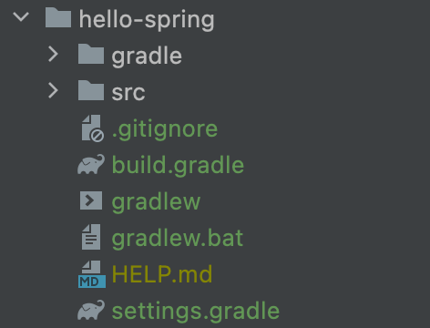
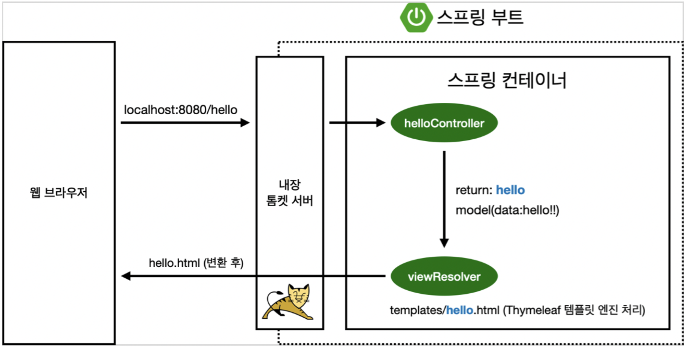

# Section 1. 프로젝트 환경설정
## #1. 프로젝트 환경설정
Development Environment

    java version : jdk 11
    IDE : IntelliJ

스프링 프로젝트 생성 > https://start.spring.io (springboot starter site)

    Project Setting
        Project: Gradle
        Project Spring Boot: 2.3.x
        Language: Java
        Packaging: Jar
        Java: 11
    Project Metadata
        groupId: hello
        artifactId: hello-spring
    Dependencies: Spring Web, Thymeleaf


hello-spring project 생성


- build.gradle - version 설정, external libraries 불러오는 역할
- .gitignore - 소스코드 관리

hello-spring/src/main/java/hello/hellospring/HelloSpringApplication.java
위 파일 실행 후 localhost:8080 접속 가능한 것을 확인할 수 있음.

## #2. 라이브러리 살펴보기

> Gradle은 **의존관계**가 있는 라이브러리를 함께 다운로드 한다.

### *스프링 부트 라이브러리*

- spring-boot-starter-web
  - spring-boot-starter-tomcat: 톰캣 (웹서버)
  - spring-webmvc: 스프링 웹 MVC
- spring-boot-starter-thymeleaf: 타임리프 템플릿 엔진(View)
- spring-boot-starter(공통): 스프링 부트 + 스프링 코어 + 로깅
  - spring-boot
    - spring-core
  - spring-boot-starter-logging
    - logback, slf4j

### *테스트 라이브러리*

- spring-boot-starter-test
    - junit: 테스트 프레임워크
    - mockito: 목 라이브러리
    - assertj: 테스트 코드를 좀 더 편하게 작성하게 도와주는 라이브러리
    - spring-test: 스프링 통합 테스트 지원

## #3. View 환경설정

### *Welcome page 만들기*

```main/resources/static/index.html```
```html
<!DOCTYPE HTML>
  <html>
  <head>
      <title>Hello</title>
      <meta http-equiv="Content-Type" content="text/html; charset=UTF-8" />
  </head>
  <body>
  Hello
  <a href="/hello">hello</a>
  </body>
  </html>
```
- 스프링 부트가 제공하는 Welcome Page 기능
  - ```static/index.html``` 을 올려두면 Welcome page 기능을 제공한다.
  - https://docs.spring.io/spring-boot/docs/2.3.1.RELEASE/reference/html/spring-boot-features.html#boot-features-spring-mvc-welcome-page

### *thymeleaf 템플릿 엔진*
- thymeleaf 공식 사이트: https://www.thymeleaf.org/
- 스프링 공식 튜토리얼: https://spring.io/guides/gs/serving-web-content/
- 스프링부트 메뉴얼: https://docs.spring.io/spring-boot/docs/2.3.1.RELEASE/reference/ html/spring-boot-features.html#boot-features-spring-mvc-template-engines

```main/java/hello.hellospring/controller/HelloController```
```java
@Controller
public class HelloController {
    
    @GetMapping("hello")
    public String hello(Model model) {
        model.addAttribute("data", "hello!!");
        return "hello";
    }
}
```
```resources/templates/hello.html```
```html
<!DOCTYPE HTML>
<html xmlns:th="http://www.thymeleaf.org">
<head>
    <title>Hello</title>
    <meta http-equiv="Content-Type" content="text/html; charset=UTF-8" />
</head>
<body>
<p th:text="'안녕하세요. ' + ${data}" >안녕하세요. 손님</p>
</body>
</html>
```
*thymeleaf 템플릿엔진 동작 확인*
- 실행: http://localhost:8080/hello

동작 환경 그림

- 컨트롤러에서 리턴 값으로 문자를 반환하면 뷰 리졸버( viewResolver )가 화면을 찾아서 처리한다.
  - 스프링 부트 템플릿엔진 기본 viewName 매핑
  - ```resources:templates/``` +{ViewName}+ ```.html```
> 참고: spring-boot-devtools 라이브러리를 추가하면, html 파일을 컴파일만 해주면 서버 재시작 없이 View 파일 변경이 가능하다.<br/>
> 인텔리J 컴파일 방법: 메뉴 build

## #4. 빌드하고 실행하기
콘솔로 이동
1. ```./gradlew build```
2. ```cd build/libs```
3. ```java -jar hello-spring-0.0.1-SNAPSHOT.jar```
4. 실행 확인
