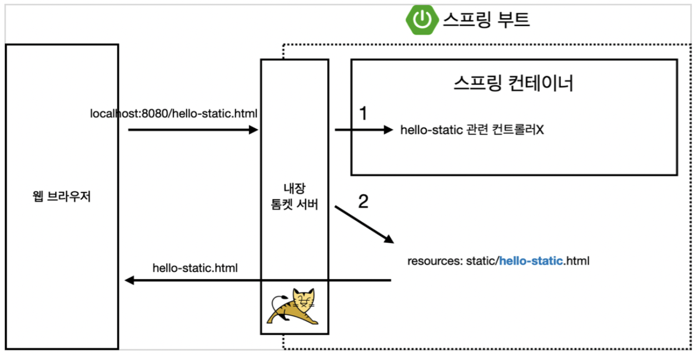
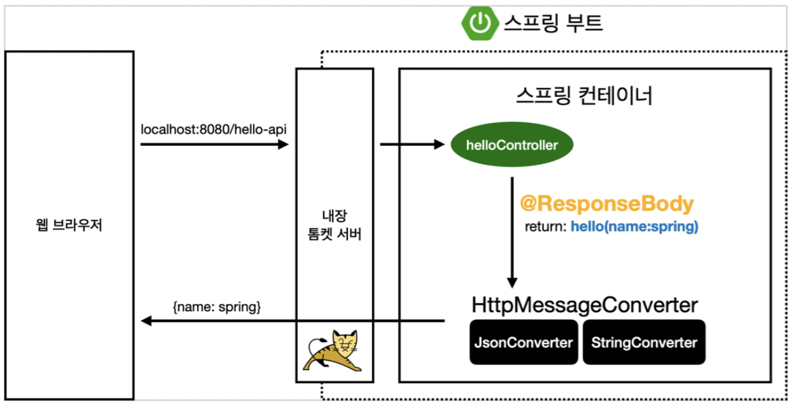

# Section 2. 스프링 웹 개발 기초

## #1. 정적 컨텐츠
- 스프링 부트 정적 컨텐츠 기능
- welcome page와 같이 *파일을 그대로* 웹브라우저에서 내려줌
- 서버에서 하는 일 없음.
- https://docs.spring.io/spring-boot/docs/2.3.1.RELEASE/reference/html/spring-boot-features.html#boot-features-spring-mvc-static-content

```resources/static/hello-static.html```
```html
<!DOCTYPE HTML>
<html>
<head>
    <title>static content</title>
    <meta http-equiv="Content-Type" content="text/html; charset=UTF-8" />
</head>
<body>
정적 컨텐츠 입니다.
</body>
</html>
```
### *실행*
http://localhost:8080/hello-static.html
- 작성한 파일이 그대로 반환 됨을 확인할 수 있음
### *정적 컨텐츠 이미지*

- 위처럼 요청한 이름에 대한 컨트롤러가 없을 때 resources 내부에 있는 정적 컨텐츠를 찾아서 반환함
## #2. MVC와 템플릿 엔진
- MVC : Model, View, Controller
- 정적 컨텐츠 방식과 차이점 : 서버에서 변형을 해서 내려주는 방식
### *Controller*
```java
@Controller
public class HelloController {
    
  @GetMapping("hello-mvc")
  public String helloMvc(@RequestParam("name") String name, Model model) {
      model.addAttribute("name", name);
      return "hello-template";
  }
}
```
### *View*
```resources/template/hello-template.html```
```html
<html xmlns:th="http://www.thymeleaf.org">
<body>
<p th:text="'hello ' + ${name}">hello! empty</p>
</body>
</html>
```
### *실행*
http://localhost:8080/hello-mvc?name=spring
### *MVC, 템플릿 엔진 이미지*


## #3. API
### *@ResponseBody 문자 반환*
```java
@Controller
public class HelloController {
    
  @GetMapping("hello-string")
  @ResponseBody
  public String helloString(@RequestParam("name") String name) {
      return "hello " + name;
  }
}
```
- ```@ResponseBody```를 사용하면 뷰 리졸버(```viewResolver```)를 사용하지 않음
- 대신 HTTP의 BODY에 문자 내용을 직접 반환(HTML BODY TAG를 말하는 것이 아님)

### *실행*
http://localhost:8080/hello-string?name=spring

### *@ResponseBody 객체 반환*
```java
@Controller
public class HelloController {
    
  @GetMapping("hello-string")
  @ResponseBody
  public Hello helloApi(@RequestParam("name") String name) {
      Hello hello = new Hello();
      hello.setName(name);
      return hello;
  }
  
  static class Hello { 
      private String name;
      
      public String getName() {
          return name;
      }
      
      public void setName(String name) {
          this.name = name;
      } 
  }
}
```
- ```@ResponseBody```를 사용하고, 객체를 반환하면 객체가 JSON으로 변환됨
### *실행*
http://localhost:8080/hello-api?name=spring
### *@ResponseBody 사용 원리*

- ```@ResponseBody```를 사용
  - HTTP의 BODY에 문자 내용을 직접 반환
  - ```viewResolver``` 대신에 ```HttpMessageConverter``` 가 동작
  - 기본 문자처리: ```StringHttpMessageConverter```
  - 기본 객체처리: ```MappingJackson2HttpMessageConverter```
  - byte 처리 등등 기타 여러 ```HttpMessageConverter```가 기본으로 등록되어 있음
> 참고: 클라이언트의 HTTP Accept 해더와 서버의 컨트롤러 반환 타입 정보 둘을 조합해서 ```HttpMessageConverter```가 선택된다. 더 자세한 내용은 스프링 MVC 강의에서 설명.
